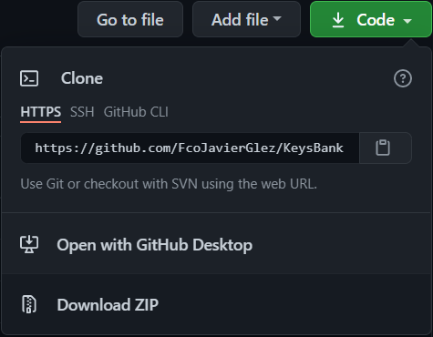
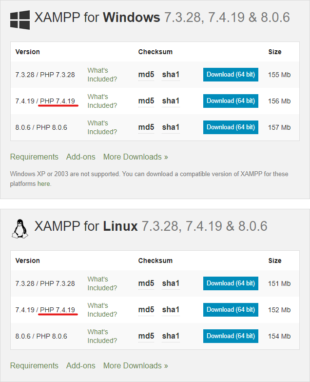
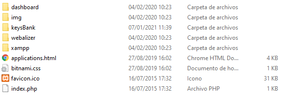
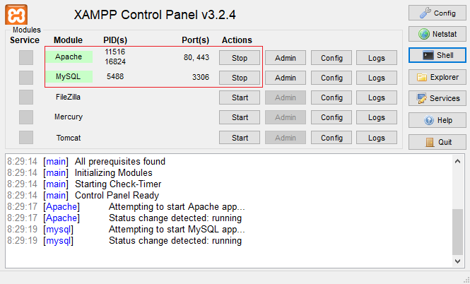
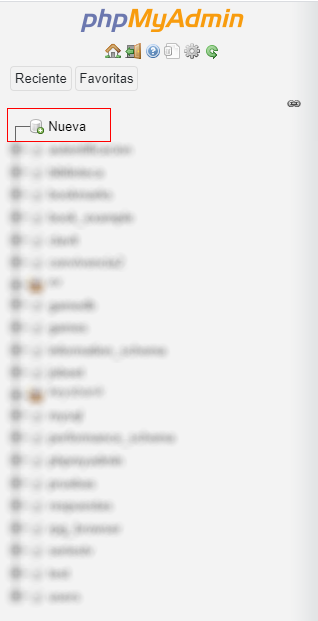
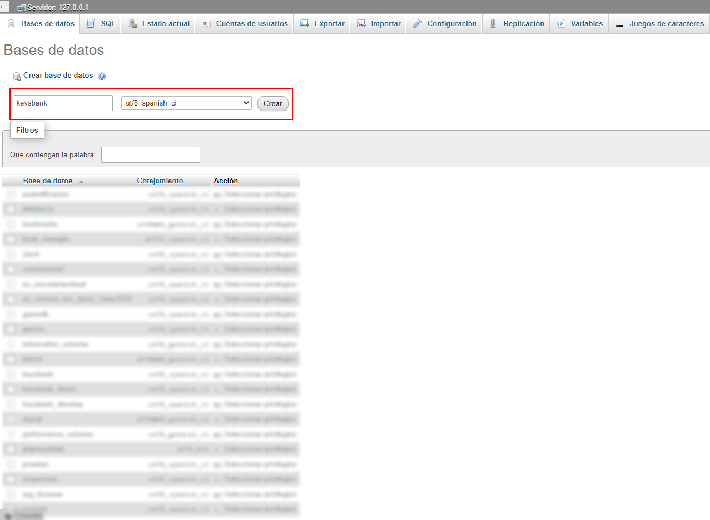
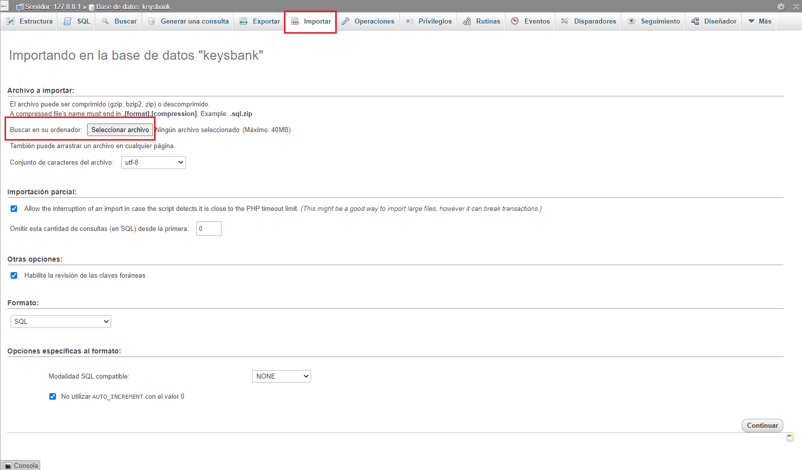
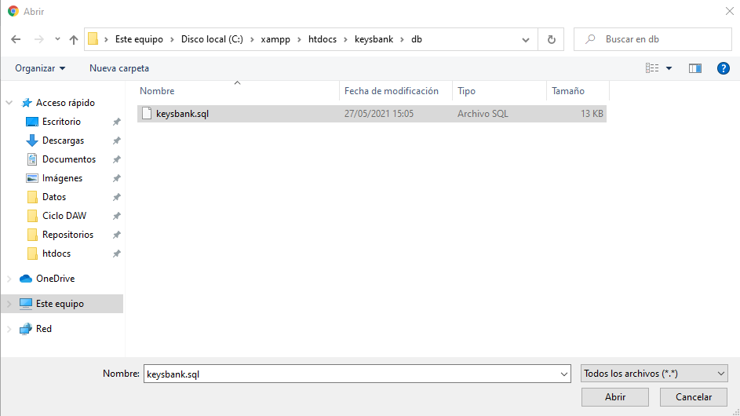
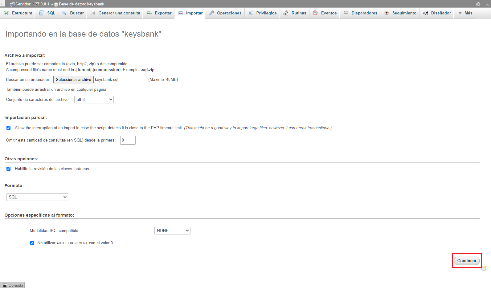
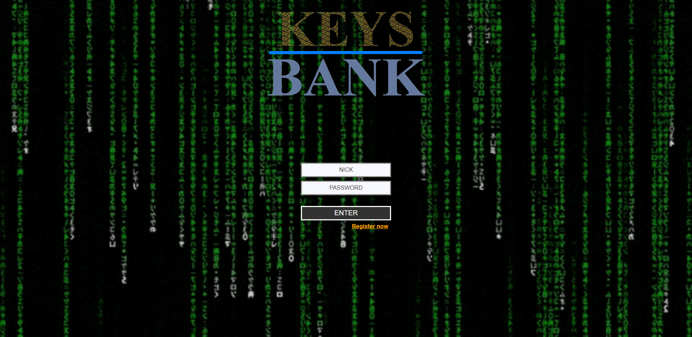

# :key: KeysBank :key:
## Autor: González Sabariego, Francisco Javier.

    
    
    

---
1. [Descripción del proyecto](#descripción)
2. [Información sobre despliegue](#despliegue)
3. [Información sobre cómo usarlo](#cómo-usarlo)
4. [Autores](#autores)
5. [Licencia](#license)
---
## Descripción
**KeysBank es una aplicación web de gestión de contraseñas** diseñada tanto para uso privado cómo público.

Los usuarios con un perfil activado podrán registrar, editar y eliminar sus cuentas cuando lo requieran, beneficiándose de las herramientas que la app pone a su disposición cómo: 

1. **Un generador de contraseñas aleatorias que ofrece la contraseña más robusta posible para las características solicitadas.**
2. **Alertas de nick usados en otras cuentas registradas.**
3. **Alerta de contraseña demasiado antigua.**
4. **Capacidad de copiar al portapapeles la contraseña de una cuenta.**
5. **Etc.**

En una aplicación de estas características **es fundamental la seguridad**. Por tanto, para garantizar un servicio robusto y evitar posibles filtraciones de información sensible la app se construye sobre 4 pilares:
1. **Base de datos encriptada.**
2. **Protección ante posibles inyecciones SQL.**
3. **Consultas a la API para obtención dinámica de recursos o información (evitando el uso de información sensible en el árbol DOM).**
4. **Navegación y enrutamiento seguro según el perfil y los datos asociados.**

## Despliegue
1. **Descarga el proyecto:**
    - Puedes descargar el proyecto pulsando el botón de code y a continuación en download zip:
    

    - O si tienes instalado Git en tu equipo haciendo uso del siguiente comando:
    ~~~
        git clone https://github.com/FcoJavierGlez/keys_bank.git .
    ~~~

2. **Descarga e instalación de XAMPP:**
    - Ahora procedemos a [descargar XAMPP](https://www.apachefriends.org/download.html). **¡IMPORTANTE!: Asegúrate de instalar, o tener instalado, un XAMPP que ejecute una versión de PHP ~7.4**
      _Versiones de XAMPP_

    - Una vez se haya descargado procede a instalarlo y **asegúrate de instalar: PHP, phpMyAdmin y MySQL**.

3. **Instalación de la App:**
    - Dirígete a la carpeta donde hayas instalado XAMPP (en windows por defecto es C:\xampp). En su interior encontrarás una carpeta llamada _htdocs_, **entra en _htdocs_ y copia la carpeta _keysbank_ (y todo su contenido)** que acabas de descargar de este mismo repositorio.
      _Carpeta htdocs_
    
4. **Creación de la base de datos:**
    - Ahora abre el panel de control de XAMPP (puedes ejecutarlo en esta ruta: C:\xampp\xampp-control.exe) y arranca el servicio de apache y de mysql como verás en la siguiente foto:
      _Panel de control de XAMPP_

    - Una vez arrancados ambos servicios vamos a crear la base de datos. Abre un navegador cualquiera y dirígite a esta URL: _localhost/phpmyadmin/index.php_

    - **Crea una base de datos** seleccionando la opción de "Nueva" en el panel de la izquierda de phpMyAdmin:
      _Botón crear base de datos_

    - La base de datos **debe llamarse _keysbank_ y debe poseer el juego de caracteres _utf8_spanish_ci_** como se ve a continuación:
      _Nombre y juego de caracteres_

    - Una vez creada la base de datos **importamos el fichero _keysbank.sql_ que se encuentra en _keysbank/db/keysbank.sql_** como se ve a continuación:

      _Vista importar fichero_
      _Ruta fichero keysbank.sql_

    - Seleccionado el fichero aceptamos y **se creará la base de datos de la aplicación keysbank**:

      _Aceptamos_

5. **Puesta en marcha:**
    - Si todo ha ido bien ahora podremos acceder a la aplicación a través de esta ruta en el navegador _localhost/keysbank/_

      _Login de la app_

## Uso
Texto

## Autores
### Version ~1.0.0: FcoJavierGlez
- GitHub: [FcoJavierGlez](https://github.com/FcoJavierGlez)
- LinkedIn: [FcoJavierGlez](https://www.linkedin.com/in/francisco-javier-gonz%C3%A1lez-sabariego-51052a175/)
- Twitter: [FcoJavierGlez](https://twitter.com/Fco_Javier_Glez)

## License
Copyright (c) 2021 Francisco Javier González Sabariego. [Licensed under MIT license](https://github.com/FcoJavierGlez/keys_bank/blob/main/LICENSE).